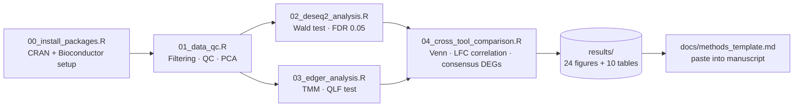

### Rnaseq-Deseq2-pipeline
# RNA-seq Differential Expression Pipeline — DESeq2 × edgeR Cross-Validation


## Author

**Abdullah Afzal Alvi**
BSc (Hons.) Biotechnology, Department of Plant Production & Biotechnology, University of Layyah, Pakistan

[](https://github.com/abdullahafzalalvi)
[](https://orcid.org/0009-0006-7961-8226)
[](https://scholar.google.com/citations?user=2kmK6UwAAAAJ)

A modular, reproducible RNA-seq differential expression pipeline in R that runs **DESeq2** and **edgeR** independently on the same count matrix, then cross-validates the two result sets against each other. Genes flagged as significant by *both* tools are reported separately as a high-confidence consensus set — a standard robustness check for thesis chapters and manuscripts.

This repository ships with a **complete, already-executed run** on the *airway* dataset (Himes et al., 2014) — every script, plot, and table in `results/` is real output, not a placeholder.

---

## Table of Contents
- [Why This Pipeline Exists](#why-this-pipeline-exists)
- [Pipeline Workflow](#pipeline-workflow)
- [Key Results at a Glance](#key-results-at-a-glance)
- [Visualization Gallery](#visualization-gallery)
- [Repository Structure](#repository-structure)
- [Tools & Exact Versions](#tools--exact-versions)
- [Example Dataset](#example-dataset)
- [Using Your Own Data](#using-your-own-data)
- [How to Run](#how-to-run)
- [Output Files Reference](#output-files-reference)
- [Statistical Thresholds](#statistical-thresholds)
- [Manuscript-Ready Methods Section](#manuscript-ready-methods-section)
- [Reproducibility](#reproducibility)
- [Citation](#citation)
- [Author](#author)

---

## Why This Pipeline Exists

Most RNA-seq analyses published alongside papers are not reproducible — the code is either withheld or written as a single disposable script with no structure, no version pinning, and no record of what was actually run. This pipeline is built to avoid that:

- **Single-tool results are not trusted by default.** DESeq2 and edgeR use different normalization and testing strategies (median-of-ratios + Wald test vs. TMM + quasi-likelihood F-test). Agreement between them is treated as evidence of robustness, not assumed.
- **Every number in this README is traceable** to a script and a CSV in `results/tables/`. Nothing below is illustrative — it's the actual output of `scripts/01_data_qc.R` through `scripts/04_cross_tool_comparison.R`.
- **Drop-in for any count matrix.** Swap the two data-loading lines in each script and the rest of the pipeline runs unchanged.

---

## Pipeline Workflow



---

## Key Results at a Glance

Numbers below are from the included run (8 samples: 4 treated / 4 untreated, *airway* dataset).

| Stage | Metric | Value |
|---|---|---|
| QC | Raw genes in count matrix | 63,677 |
| QC | Genes retained (≥10 total reads) | 22,369 |
| QC | Genes removed by low-count filter | 41,308 |
| QC | Library size range | 15.16M – 30.81M reads |
| DESeq2 | Genes tested (post independent filtering) | 17,982 |
| DESeq2 | Significant DEGs (FDR < 0.05, \|LFC\| > 1.5) | **439** (234 up / 205 down) |
| edgeR | Genes tested | 22,369 |
| edgeR | Significant DEGs | **436** (224 up / 212 down) |
| Cross-tool | Consensus DEGs (both tools agree) | **369** (73% Venn overlap) |
| Cross-tool | Pearson *r*, log₂FC concordance | **0.999** |
| Cross-tool | Strongest single DEG (DESeq2) | ENSG00000152583, adj-*p* ≈ 1.7 × 10⁻¹⁰⁰ |
| PCA | Variance explained, PC1 / PC2 | 44.7% / 24.5% (clean separation by treatment) |

The 73% Venn overlap and r = 0.999 log₂FC correlation are the headline result: two methodologically different DE frameworks land on almost identical fold-change estimates and a large shared DEG set, which is exactly the kind of cross-tool agreement reviewers look for.

---

## Visualization Gallery

| DESeq2 Volcano | edgeR Volcano |
|:---:|:---:|
|  |  |

| PCA — VST-normalized | DEG Overlap (Venn) |
|:---:|:---:|
|  |  |

| Raw-count QC PCA | DESeq2 vs edgeR LFC Correlation |
|:---:|:---:|
|  |  |

All plots above also have publication-resolution PDF versions in `results/plots/`. Heatmaps, MA/MD plots, dispersion plots, and BCV plots are PDF-only (high gene counts render poorly as PNG).

---

## Repository Structure

```
rnaseq-deseq2-pipeline/
├── .gitignore
├── README.md
├── docs/
│   └── methods_template.md          # Pre-written Methods section, ready to paste
├── functions/
│   └── helpers.R                    # summarize_deg_counts(), filter_deg(), theme_publication(), etc.
├── scripts/
│   ├── 00_install_packages.R        # CRAN + Bioconductor dependency installer
│   ├── 01_data_qc.R                 # Filtering, library size, gene detection, sample correlation, PCA
│   ├── 02_deseq2_analysis.R         # DESeq2: DEGs, VST, PCA, MA/volcano/heatmap/dispersion plots
│   ├── 03_edger_analysis.R          # edgeR: TMM normalization, QLF test, BCV/MD/volcano/heatmap plots
│   └── 04_cross_tool_comparison.R   # Venn overlap, LFC correlation, consensus DEG table
└── results/
    ├── plots/                       # 24 figures (14 PDF + 10 PNG)
    └── tables/                      # 10 tables — DEG lists, normalized counts, session logs
```

> **Note:** there is no `data/` folder because the included run loads the *airway* dataset directly from Bioconductor (`data("airway")`). To use your own counts, see [Using Your Own Data](#using-your-own-data) — you'll create `data/raw/` and `data/metadata/` yourself.

---

## Tools & Exact Versions

These are the versions actually recorded in `results/tables/*_session_info.txt` from the included run — not approximations:

| Package | Version | Role |
|---|---|---|
| R | 4.5.2 | Runtime |
| DESeq2 | 1.50.2 | Primary DE analysis (Wald test) |
| edgeR | 4.8.2 | Parallel DE analysis (QLF test) |
| limma | 3.66.0 | edgeR dependency |
| ggplot2 | 4.0.3 | All custom visualizations |
| EnhancedVolcano | 1.28.2 | Volcano plots |
| pheatmap | 1.0.13 | Heatmaps |
| ggrepel | 0.9.6 | Label placement on PCA/volcano plots |
| RColorBrewer | 1.1-3 | Color palettes |
| ggVennDiagram | (see `00_install_packages.R`) | DEG overlap visualization |
| airway | 1.30.0 | Example dataset |
| tidyverse | 2.0.0 | Data wrangling |

Full session info, including every loaded namespace, is preserved in `results/tables/DESeq2_session_info.txt` and `results/tables/edgeR_session_info.txt` for exact reproducibility.

---

## Example Dataset

The included run uses the **airway** dataset (Himes et al., 2014, *PLOS ONE*) — human airway smooth muscle cells, dexamethasone-treated vs. untreated, 4 replicates per group:

```r
BiocManager::install("airway")
```

---

## Using Your Own Data

**Count matrix** (`data/raw/counts.csv`):
- Rows = genes (Ensembl IDs or gene symbols)
- Columns = sample names
- Values = raw integer counts (not normalized, not log-transformed)

**Metadata** (`data/metadata/coldata.csv`):
- Rows = samples, matching count matrix column names **exactly**
- Required column: `condition`
- Optional: `batch`, `replicate`

Then in each script, comment out the `data("airway")` block and uncomment the two lines already provided directly beneath it:

```r
# --- Option B: Load your own data ---
# count_matrix <- read.csv("data/raw/counts.csv", row.names = 1)
# col_data     <- read.csv("data/metadata/coldata.csv", row.names = 1)
```

For non-human data, also swap `org.Hs.eg.db` in `00_install_packages.R` for the appropriate annotation package (e.g., `org.At.tair.db` for *Arabidopsis*, `org.Mm.eg.db` for mouse).

---

## How to Run

```r
# Step 0: Install all dependencies (CRAN + Bioconductor)
source("scripts/00_install_packages.R")

# Step 1: Quality control — filtering, library sizes, PCA
source("scripts/01_data_qc.R")

# Step 2: DESeq2 differential expression
source("scripts/02_deseq2_analysis.R")

# Step 3: edgeR differential expression (parallel validation)
source("scripts/03_edger_analysis.R")

# Step 4: Cross-tool comparison and consensus DEGs
source("scripts/04_cross_tool_comparison.R")
```

> ⚠️ **Working directory matters.** All scripts write to relative paths (`results/plots/...`, `results/tables/...`). Run them with the **repository root** as your working directory — e.g., open `rnaseq-deseq2-pipeline.Rproj` in RStudio, or run `setwd("path/to/rnaseq-deseq2-pipeline")` first. Sourcing from inside `scripts/` will create a nested `scripts/results/` folder instead.

---

## Output Files Reference

**Plots** (`results/plots/`):

| File | Description |
|---|---|
| `qc_library_sizes.pdf/png` | Total mapped reads per sample |
| `qc_gene_detection.pdf/png` | Genes detected per sample |
| `qc_sample_correlation_heatmap.pdf` | Pearson correlation between samples |
| `qc_pca_raw.pdf/png` | PCA on raw log2-counts |
| `deseq2_pca_vst.pdf/png` | PCA on VST-normalized counts |
| `deseq2_ma_plot.pdf` | MA plot (DESeq2) |
| `deseq2_volcano.pdf/png` | Volcano plot (DESeq2) |
| `deseq2_heatmap_top50.pdf` | Top 50 DEGs, z-scored VST counts |
| `deseq2_dispersion.pdf` | Gene-wise dispersion estimates |
| `edger_bcv_plot.pdf` | Biological coefficient of variation |
| `edger_qldisp_plot.pdf` | Quasi-likelihood dispersions |
| `edger_volcano.pdf/png` | Volcano plot (edgeR) |
| `edger_md_plot.pdf` | MD plot (edgeR) |
| `edger_heatmap_top50.pdf` | Top 50 DEGs, z-scored logCPM |
| `venn_deseq2_edger_overlap.pdf/png` | DEG overlap between tools |
| `lfc_correlation_scatter.pdf/png` | Log2FC concordance, DESeq2 vs edgeR |

**Tables** (`results/tables/`):

| File | Description |
|---|---|
| `qc_summary.csv` | Gene/sample counts before and after filtering |
| `DESeq2_results.csv` | Full DESeq2 results, all tested genes |
| `DESeq2_significant_DEGs.csv` | DESeq2 DEGs only (FDR < 0.05, \|LFC\| > 1.5) |
| `DESeq2_VST_normalized_counts.csv` | VST-normalized expression matrix |
| `DESeq2_session_info.txt` | Exact R/package versions for the DESeq2 run |
| `edgeR_results.csv` | Full edgeR results, all tested genes |
| `edgeR_significant_DEGs.csv` | edgeR DEGs only |
| `edgeR_session_info.txt` | Exact R/package versions for the edgeR run |
| `consensus_DEGs.csv` | Genes significant in **both** tools, with mean LFC and direction |
| `tool_comparison_summary.csv` | Side-by-side DEG counts, DESeq2 vs edgeR |

---

## Statistical Thresholds

- Minimum count filter: **≥10 total reads** across all samples
- Adjusted *p*-value cutoff: **0.05** (Benjamini–Hochberg FDR)
- Log2 fold change cutoff: **|1.5|**
- Both thresholds applied identically in DESeq2 and edgeR for a fair comparison

To change thresholds, edit the `case_when()` block in `02_deseq2_analysis.R` and `03_edger_analysis.R` (search for `padj < 0.05`).

---

## Manuscript-Ready Methods Section

`docs/methods_template.md` contains a fully written Methods paragraph with citations (Love et al. 2014; Robinson et al. 2010; Benjamini & Hochberg 1995, etc.), with bracketed placeholders for run-specific numbers. Using the included run, those brackets fill in as:

- Genes retained after filtering: **22,369**
- DESeq2 version: **1.50.2** · edgeR version: **4.8.2**
- Pearson's *r* (LFC concordance): **0.999**

---

## Reproducibility

- Every analysis script ends by writing full `sessionInfo()` output to `results/tables/`, so the exact package versions behind any number in this README can be independently verified.
- All thresholds are hard-coded at the top of each script rather than buried in function calls, so a reviewer can audit them in seconds.
- The pipeline is deterministic given the same input matrix and package versions — no random seeds are used anywhere in the DE testing steps.

---

## Citation

If you use this pipeline, please cite the underlying methods:

- Love MI, Huber W, Anders S (2014). Moderated estimation of fold change and dispersion for RNA-seq data with DESeq2. *Genome Biology*, 15:550.
- Robinson MD, McCarthy DJ, Smyth GK (2010). edgeR: a Bioconductor package for differential expression analysis of digital gene expression data. *Bioinformatics*, 26(1):139–140.
- Himes BE et al. (2014). RNA-Seq transcriptome profiling identifies CRISPLD2 as a glucocorticoid responsive gene that modulates cytokine function in airway smooth muscle cells. *PLOS ONE*, 9(3):e99625. [Example dataset]

---


---

